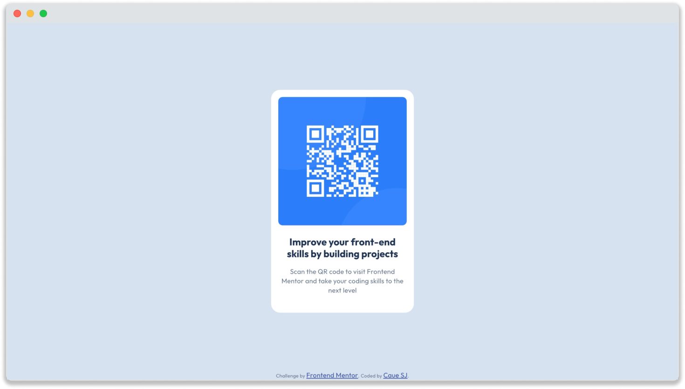

# Frontend Mentor - QR code component solution

This is my solution to the [QR code component challenge on Frontend Mentor](https://www.frontendmentor.io/challenges/qr-code-component-iux_sIO_H).

## Table of contents

- [Screenshot](#screenshot)
- [Links](#links)
- [Continued development](#continued-development)
- [Useful resources](#useful-resources)

- [Author](#author)

### Screenshot

### Links

- Solution URL: [Add solution URL here](https://your-solution-url.com)
- Live Site URL: [Link to live site, hosted on GitHub Pages](https://cauesj.github.io/qr-code-component/)

### Continued development

In this challenge, I didn't build an actual component, because the HTML code is hardcoded and doesn't offer good code reuse.
I intend to create a properly reusable component, using the concepts of Web Components [Link to documentation of Web Components](https://developer.mozilla.org/en-US/docs/Web/API/Web_components).

### Useful resources

- [A Modern CSS Reset](https://www.joshwcomeau.com/css/custom-css-reset/) - This is a simple and good example of Reset CSS for a modern browsers, and explained step-by-step.
- [Variable Fonts](https://fonts.google.com/knowledge/introducing_type/introducing_variable_fonts) - Explanation about variable fonts. I consulted this site to find out wheter it was better to use variable fonts or fixed-width fonts.

## Author

- Frontend Mentor - [@caueSJ](https://www.frontendmentor.io/profile/caueSJ)
- Email: caue.silvaa@gmail.com